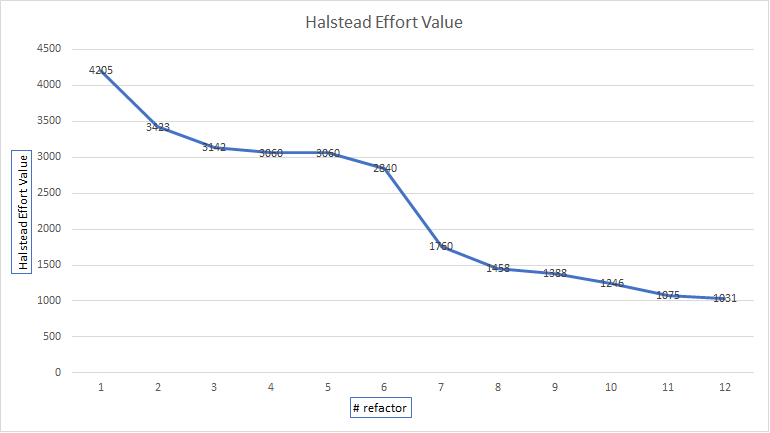

# Zaawansowane Języki Programowania - PyCharmers

| Wykonawcy | Prowadzący | Język<br>programowania | Narzędzie<br>analizy kodu | Źródło kodu | Data oddania |
:-:|:-:|:-:|:-:|:-:|:-:
| Adamczyk Tomasz<br>Bilikiewicz Semen<br>Gołębiewski Artur | dr Bzyl Włodzimierz | [Python](https://www.python.org/) | [PyLint](https://www.pylint.org/) | [Gilded Rose<br>Refactoring Kata](https://github.com/emilybache/GildedRose-Refactoring-Kata) | 12.01.2019

---

### Wprowadzenie:

__Python__ - język programowania wysokiego poziomu ogólnego przeznaczenia, o rozbudowanym pakiecie bibliotek standardowych, którego ideą przewodnią jest czytelność i klarowność kodu źródłowego. Jego składnia cechuje się przejrzystością i zwięzłością.

__PyLint__ - narzędzie do analizy statycznej kodu Pythona, które szuka błędów programistycznych, pomaga w egzekwowaniu standardu kodowania, wykrywa "zapachy kodu" i oferuje proste propozycje refaktoryzacji.

__Halstead Effort (złożoność Halsteada)__ - takie metryki jak: liczba unikatowych operatorów, liczba unikatowych operandów, całkowita liczba wystąpień operatorów oraz całkowita liczba wystąpień operandów, które dotyczą rozmiaru programu, pozwalają na zdefiniowanie bardziej skomplikowanych metryk złożoności. Wyróżnia się wśród nich m.in. trudność, poziom programu, wysiłek, czas, szacunkową liczbę błędów. Im mniejsza wartość, tym lepiej.

---

### Wykres wartości Halstead Effort:

<p align="center">
  
</p>

#### Oryginalny kod metody update_quality():

````diff
- def update_quality(self):
-   for item in self.items:
-     if item.name != "Aged Brie" and item.name != "Backstage passes to a TAFKAL80ETC concert":
-       if item.quality > 0:
-         if item.name != "Sulfuras, Hand of Ragnaros":
-           item.quality = item.quality - 1
-     else :
-       if item.quality < 50:
-         item.quality = item.quality + 1
-         if item.name == "Backstage passes to a TAFKAL80ETC concert":
-           if item.sell_in < 11:
-             if item.quality < 50:
-               item.quality = item.quality + 1
-           if item.sell_in < 6:
-             if item.quality < 50:
-               item.quality = item.quality + 1
-     if item.name != "Sulfuras, Hand of Ragnaros":
-       item.sell_in = item.sell_in - 1
-     if item.sell_in < 0:
-       if item.name != "Aged Brie":
-         if item.name != "Backstage passes to a TAFKAL80ETC concert":
-           if item.quality > 0:
-             if item.name != "Sulfuras, Hand of Ragnaros":
-               item.quality = item.quality - 1
-         else :
-           item.quality = item.quality - item.quality
-       else :
-         if item.quality < 50:
-           item.quality = item.quality + 1
````

#### I efekt końcowy:

````diff
+ def update_quality(self):
+   for item in self.items:
+     self.update_one_item(item)
+ 
+ def update_one_item(self, item):
+   if item.name == "Aged Brie":
+     self.increment_quality(item)
+     item.sell_in = item.sell_in - 1
+     if self.has_expired(item):
+       self.increment_quality(item)
+       item.sell_in = item.sell_in - 1
+   elif item.name == "Backstage passes to a TAFKAL80ETC concert":
+     self.increment_quality(item)
+     item.sell_in = item.sell_in - 1
+     if item.sell_in < 11:
+       self.increment_quality(item)
+     if item.sell_in < 6:
+       self.increment_quality(item)
+     if self.has_expired(item):
+       item.quality = 0
+   elif item.name == "Sulfuras, Hand of Ragnaros":
+     pass
+   else:
+     self.decrement_quality(item)
+     item.sell_in = item.sell_in - 1
+     if self.has_expired(item):
+       self.decrement_quality(item)
+ 
+ def has_expired(self, item):
+   return item.sell_in < 0
+ 
+ def decrement_quality(self, item):
+   if item.quality > 0:
+     item.quality = item.quality - 1
+ 
+ def increment_quality(self, item):
+   if item.quality < 50:
+     item.quality = item.quality + 1
````